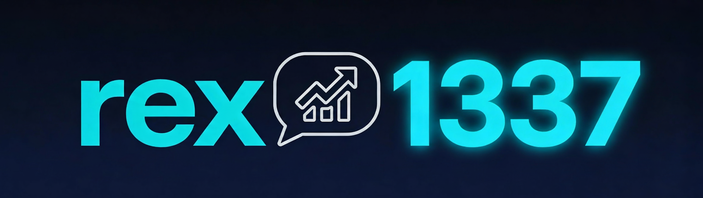

[Русский](#russian) | [English](#english)

---

<a name="russian"></a>
# rex1337

[](https://www.docker.com/)
[](https://opensource.org/licenses/MIT)

Автоматизированный скрипт для фарма очков на rep4rep.com путем публикации комментариев в профилях Steam.

### Основные возможности
- Удобный веб-дашборд для мониторинга и управления.
- Автоматический контроль кулдаунов (24 часа) и лимитов (10 комментариев на аккаунт в день).
- Полная поддержка Docker для быстрого развертывания.
- Поддержка Steam 2FA через sharedSecret.

Для получения sharedSecret вы можете использовать:
- [Steam Desktop Authenticator (SDA)](https://github.com/Jessecar96/SteamDesktopAuthenticator)
- [NebulaAuth](https://github.com/achiez/NebulaAuth-Steam-Desktop-Authenticator-by-Achies)

---

### Деплой через Docker Compose (рекомендуется)
Создайте файл `docker-compose.yml` и используйте готовый образ:

```yaml
services:
  rex1337:
    image: vilio614/rex1337:latest
    container_name: rex1337
    restart: unless-stopped
    ports:
      - "1337:1337"
    environment:
      - REP4REP_KEY=YOUR_API_KEY
      - TZ=Europe/Moscow
    volumes:
      - ./data:/app/data
      - ./logs:/app/logs
      - ./avatars:/app/avatars
```

**Добавление аккаунтов:**
- Через дашборд: `http://localhost:1337`
- Вручную: отредактируйте файл `data/accounts.json`.

---

### Локальный запуск (из исходников)
1. Склонируйте репозиторий.
2. Установите зависимости: `npm install`.
3. Настройте `docker-compose.yml` (используя `build: .`).
4. Запустите: `docker-compose up -d --build`.

---

### Инструкция по запуску
После того как вы подготовили `docker-compose.yml`, запустите контейнер командой:
```bash
docker-compose up -d
```

**После запуска:**
1. Откройте панель управления в браузере по адресу `http://ваш-ip:1337`.
2. Добавьте свои Steam аккаунты через интерфейс или через `accounts.json` в папке `data`.
3. Скрипт автоматически начнет работу, соблюдая все задержки и лимиты.

### Переменные окружения
| Переменная | Описание | По умолчанию |
| :--- | :--- | :--- |
| `REP4REP_KEY` | API ключ от rep4rep.com | (Обязательно) |
| `MIN_COMMENT_DELAY` | Мин. задержка между комментариями (сек) | `30` |
| `MAX_COMMENT_DELAY` | Макс. задержка между комментариями (сек) | `80` |
| `ACCOUNT_SWITCH_DELAY`| Задержка перед сменой аккаунта (сек) | `60` |
| `PORT` | Порт для дашборда и API | `1337` |
| `LOG_LEVEL` | Уровень логирования (info, debug, error) | `info` |
| `TZ` | Часовой пояс | `Europe/Moscow` |

---

### Лицензия
Данный проект распространяется под лицензией MIT. Подробности в файле LICENSE.

<br>
<hr>
<br>

<a name="english"></a>
# rex1337

[](https://www.docker.com/)
[](https://opensource.org/licenses/MIT)

Automated script for farming points on rep4rep.com by posting comments on Steam profiles.

### Key Features
- Clean web dashboard for monitoring and management.
- Automatic cooldown management (24h) and limits (10 comments per account per day).
- Full Docker support for rapid deployment.
- Steam 2FA support via sharedSecret.

To obtain your sharedSecret, you can use:
- [Steam Desktop Authenticator (SDA)](https://github.com/Jessecar96/SteamDesktopAuthenticator)
- [NebulaAuth](https://github.com/achiez/NebulaAuth-Steam-Desktop-Authenticator-by-Achies)

---

### Deploy via Docker Compose (Recommended)
Create a `docker-compose.yml` file and use the pre-built image:

```yaml
services:
  rex1337:
    image: vilio614/rex1337:latest
    container_name: rex1337
    restart: unless-stopped
    ports:
      - "1337:1337"
    environment:
      - REP4REP_KEY=YOUR_API_KEY
      - TZ=Europe/Moscow
    volumes:
      - ./data:/app/data
      - ./logs:/app/logs
      - ./avatars:/app/avatars
```

**Adding Accounts:**
- Via Dashboard: `http://localhost:1337`
- Manually: edit `data/accounts.json`.

---

### Local Setup (from source)
1. Clone the repository.
2. Install dependencies: `npm install`.
3. Configure `docker-compose.yml` (using `build: .`).
4. Run: `docker-compose up -d --build`.

---

### Quick Start Guide
Once your `docker-compose.yml` is ready, start the container:
```bash
docker-compose up -d
```

**Post-Launch:**
1. Open the dashboard in your browser at `http://your-server-ip:1337`.
2. Add your Steam accounts via the UI or `accounts.json` in the `data` folder.
3. The script will automatically start work, respecting all delays and limits.

### Environment Variables
| Variable | Description | Default |
| :--- | :--- | :--- |
| `REP4REP_KEY` | API key from rep4rep.com | (Required) |
| `MIN_COMMENT_DELAY` | Min delay between comments (sec) | `30` |
| `MAX_COMMENT_DELAY` | Max delay between comments (sec) | `80` |
| `ACCOUNT_SWITCH_DELAY`| Delay before switching accounts (sec) | `60` |
| `PORT` | Port for dashboard and API | `1337` |
| `LOG_LEVEL` | Logging level (info, debug, error) | `info` |
| `TZ` | Timezone | `Europe/Moscow` |

---

### License
Distributed under the MIT License. See LICENSE for more information.
